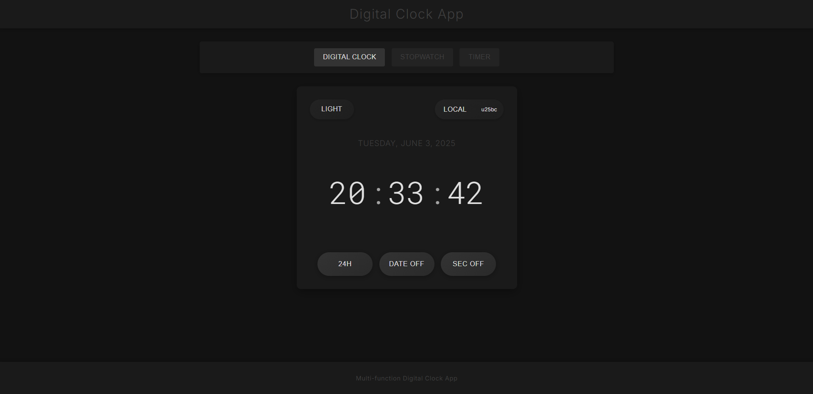

# Digital Clock App

A modern, feature-rich digital clock application built with React and TypeScript that offers multiple time-related functionalities in a sleek, user-friendly interface.

## Features

### Digital Clock
- Real-time clock display with seconds
- Toggle between 12-hour and 24-hour formats
- Show/hide date display
- Timezone selection with support for multiple global regions

### Stopwatch
- Precise timing with millisecond accuracy
- Start, stop, and reset functionality
- Lap recording to track multiple time intervals
- Visual lap history with scrollable interface

### Timer
- Countdown timer with hours, minutes, and seconds input
- Visual progress bar to show completion status
- Pause, resume, and reset capabilities
- Completion notification

## Screenshot



## Getting Started

### Prerequisites
- Node.js (v12 or higher)
- npm or yarn

### Installation

1. Clone the repository:
```
git clone https://github.com/KCprsnlcc/digital-clock.git
cd digital-clock
```

2. Install dependencies:
```
npm install
```

3. Start the development server:
```
npm start
```

4. Open your browser and navigate to:
```
http://localhost:3000
```

## Usage

- **Switch Functions**: Use the navigation tabs at the top to switch between Digital Clock, Stopwatch, and Timer
- **Digital Clock**: Toggle 24/12-hour format, show/hide date, and select different timezones
- **Stopwatch**: Use the Start/Stop, Lap, and Reset buttons to control the stopwatch
- **Timer**: Set hours, minutes, and seconds, then use Start/Pause and Reset to control the timer

## Technologies Used

- React
- TypeScript (v4.9.5)
- CSS3 (with custom animations and responsive design)
- Luxon (v3.6.1) for advanced date/time handling
- Media queries for device and orientation detection

## Customization

You can customize the appearance by modifying the CSS files for each component:
- `src/components/DigitalClock.css`
- `src/components/StopWatch.css`
- `src/components/Timer.css`
- `src/components/ClockNavigation.css`

## License

This project is licensed under the License see the [LICENSE](LICENSE.md) file for details.

## Acknowledgments

- Designed with a modern dark theme inspired by Dracula color palette
- Built as a practical exercise for React state management and component architecture
